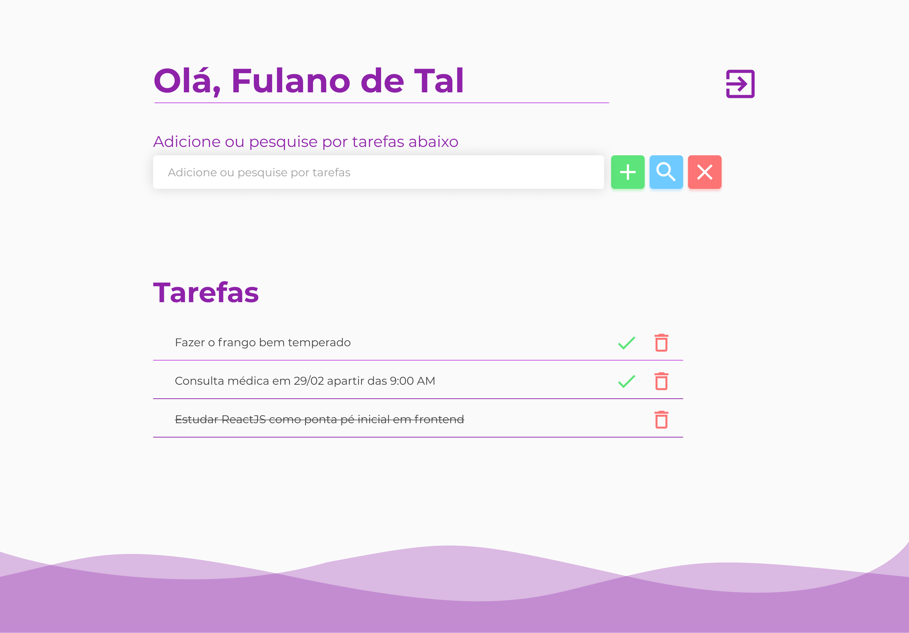

# To Do List
Simples aplicativo de gerenciamento de tarefas utilizando `Node JS`, `React JS` e `PostgreSQL`

## Protótipo
- Tela de login
<p align="center">
  
</p>

<hr>
- Tela de cadastro de usuário
<p align="center">
  
</p>

<hr>
- Tela do usuário
<p align="center">
  
</p>

## Executando
Inicialmente é necessário instalar as dependências devido não ter sido realizado o build do projeto.

Acesse a pasta/diretório `frontend` e execute o comando:
```
yarn install
```
E na pasta/diretório `backend` execute o mesmo comando:
```
yarn install
```

Após ter realizado e concluido as etapadas citadas acima para rodar o projeto é necessário ter o `Docker` e o `docker-compose` instalado em sua máquina e de preferencia seja `linux`. Após checado ou caso você esteja ciente que tais ferramentas estejam instaladas em sua máquina, execute o seguinte comando:
```
docker-compose up --build
```
caso aconteça algum erro como `Fatal SequelizeConnectionError: the database system is starting up` (ou qualquer outro) rode o mesmo comando citado anteriormente.