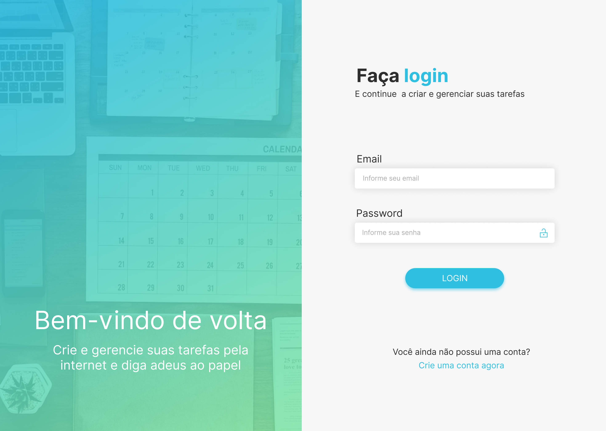
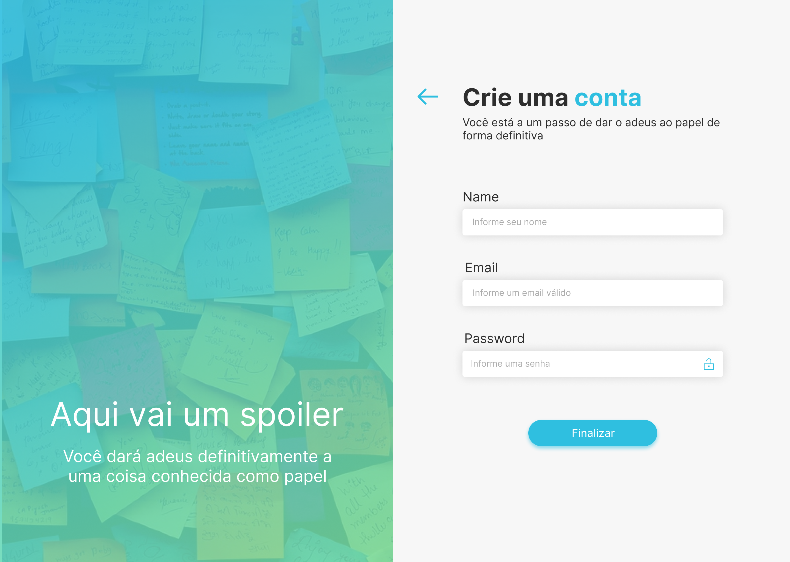
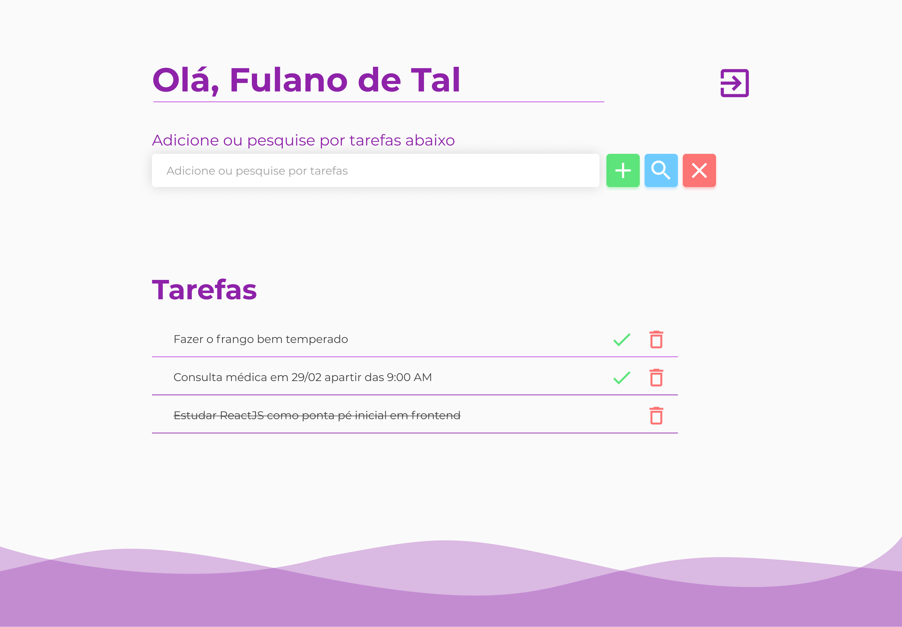

# To Do List
Simples aplicativo de gerenciamento de tarefas utilizando `Node JS`, `React JS` e `PostgreSQL`

## Protótipo
- Tela de login

  

- Tela de cadastro de usuário

  

- Tela do usuário

  

